# Design Evolution

`diagram.md` is the permanent design-history file for this project.

Rule for future work:

```text
Every new design version must be recorded here.
This file explains architecture, code relationships, data flow, trade-offs, and interview talking points.
Do not put run commands here; put setup and execution steps in runbook.md.
```

## Current Code Inventory

Domain and processing:

```text
Price.java
Quote.java
QuoteValidator.java
TradingSignal.java
TradingDecisionEngine.java
MarketDataProcessor.java
QuoteAnalysis.java
```

Application demo and shared-queue concurrency:

```text
Main.java
MarketDataFeed.java
QuoteEvent.java
QuoteMessage.java
StopMessage.java
QuoteWorker.java
ConcurrentQuoteRunner.java
ProcessingStats.java
```

Benchmark framework:

```text
QuoteGenerator.java
QuotePipeline.java
SequentialPipeline.java
SharedQueuePipeline.java
PartitionedQueuePipeline.java
WorkerMetrics.java
ModuleTiming.java
BenchmarkResult.java
BenchmarkMain.java
SelfTestMain.java
```

## Version Index

```text
V0  Project bootstrap and Hello World
V1  Simple quote variables in Main
V2  Domain model and sequential processor
V3  Shared-queue producer/consumer application demo
V4  Pure Java optimization and benchmark suite
```

## V0: Project Bootstrap and Hello World

Status:

```text
Historical version. The current code has moved beyond this, but the version is kept here as the starting point.
```

Code at that stage:

```text
pom.xml
src/main/java/com/example/hft/Main.java
scripts/run.sh
```

Design:

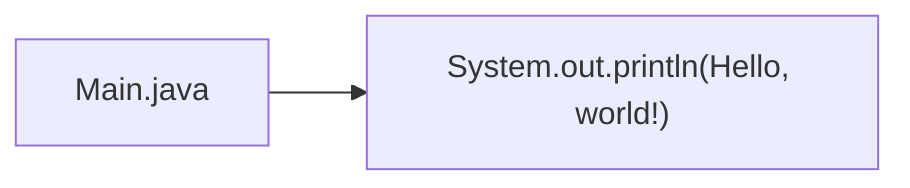

What it taught:

```text
Maven project layout
Java package declaration
Main method
Basic compile and run loop
WSL Java/Maven setup
```

Limitations:

```text
No trading domain
No reusable classes
No validation
No concurrency
No benchmark
```

Interview relevance:

```text
This version is not meant to impress an interviewer. It simply proves the local Java environment works.
```

## V1: Simple Quote Variables in Main

Status:

```text
Historical teaching version. The current code replaced this with proper domain objects.
```

Code at that stage:

```text
src/main/java/com/example/hft/Main.java
```

Design:

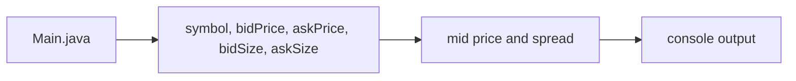

Data represented:

```text
symbol
bid price
ask price
bid size
ask size
mid price
spread
```

Key lesson:

```text
Using double for prices produced floating-point artifacts such as 0.060000000000002274.
That motivated the later Price class with long ticks.
```

Limitations:

```text
Everything lived in Main
No validation
No reusable components
Price precision problem with double
No concurrency
```

Interview relevance:

```text
This version is useful as a story: start simple, observe a precision issue, then improve the design.
```

## V2: Domain Model and Sequential Processor

Status:

```text
Current design foundation. These classes are still used by the application demo and benchmark versions.
```

Code files:

```text
Price.java
Quote.java
QuoteValidator.java
TradingSignal.java
TradingDecisionEngine.java
MarketDataProcessor.java
QuoteAnalysis.java
Main.java
```

Design:

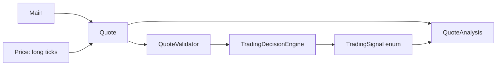

Class responsibilities:

```text
Price
Represents price as long ticks. Avoids double precision problems. Implements Comparable for ordering.

Quote
Immutable market-data object. Stores sequenceNumber, symbol, bid/ask prices, bid/ask sizes, and receivedNanos.

QuoteValidator
Rejects invalid market data early: blank symbol, non-positive sizes, and bid >= ask.

TradingSignal
Enum for finite signal outcomes: BUY_PRESSURE, SELL_PRESSURE, NEUTRAL, DO_NOT_TRADE.

TradingDecisionEngine
Applies simple rules: wide spread means do not trade; size imbalance means buy or sell pressure.

MarketDataProcessor
Orchestrates validation and decision logic. The hot-path method returns TradingSignal directly.

QuoteAnalysis
Display/result object for demo output. Kept outside the benchmark hot path where possible.
```

Runtime data flow:

```text
Quote -> QuoteValidator -> TradingDecisionEngine -> TradingSignal
Quote + TradingSignal -> QuoteAnalysis only when display output is needed
```

Important design choices:

```text
Price uses long ticks instead of double.
Quote is immutable with private final fields.
Validation is fail-fast.
Signal is an enum instead of a string.
Processor separates orchestration from validation and decision rules.
```

Trade-offs:

```text
The domain model is clear and testable.
It still allocates Quote objects in the generator and demo.
QuoteAnalysis is useful for display but avoided in benchmark hot paths.
```

Interview talking points:

```text
Core Java value objects
Static factory methods
Comparable
Enum safety
Fail-fast validation
Separation of responsibilities
Trading concepts: bid, ask, spread, mid, imbalance
```

## V3: Shared-Queue Producer/Consumer Application Demo

Status:

```text
Current runnable demo version used by scripts/run.sh.
It teaches Java concurrency clearly, but it is not the fastest benchmark version.
```

Code files:

```text
Main.java
MarketDataFeed.java
QuoteEvent.java
QuoteMessage.java
StopMessage.java
QuoteWorker.java
ConcurrentQuoteRunner.java
ProcessingStats.java
MarketDataProcessor.java
```

Design:

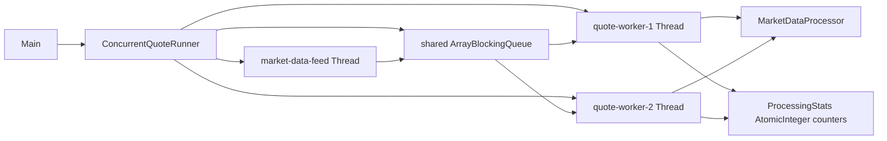

Event model:

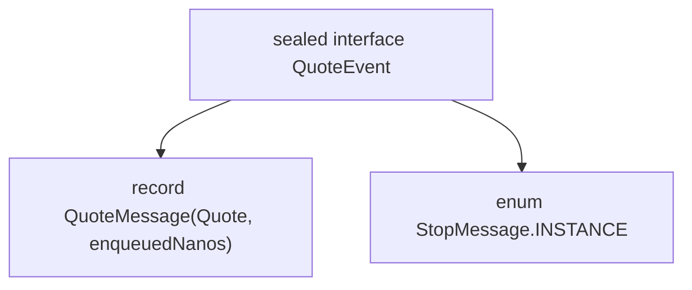

Thread lifecycle:

```text
ConcurrentQuoteRunner creates one feed thread and N worker threads.
Feed thread puts QuoteMessage events into the shared queue.
Feed thread sends one StopMessage per worker.
Workers call queue.take() until they receive StopMessage.
Runner starts every thread and then joins every thread.
```

Why this version exists:

```text
It teaches Thread, Runnable, BlockingQueue, bounded queues, interruption handling, poison-pill shutdown, and AtomicInteger.
```

Strengths:

```text
Simple producer/consumer structure
Clear backpressure model through ArrayBlockingQueue capacity
Graceful worker shutdown
Easy to explain in an interview
```

Weaknesses:

```text
All workers compete for one shared queue.
Per-symbol ordering is not guaranteed.
Processing order can vary between runs.
AtomicInteger counters are correct but can create contention under heavy write rates.
BlockingQueue handoff dominates latency for tiny per-message work.
```

Interview talking points:

```text
Producer-consumer design
Backpressure through bounded queues
Poison-pill shutdown
Thread.start versus Thread.run
Thread.join lifecycle management
InterruptedException handling
Shared mutable state and AtomicInteger
```

## V4: Pure Java Optimization and Benchmark Suite

Status:

```text
Current benchmark version. It compares multiple Java-only pipeline designs and records where latency is added.
```

Code files:

```text
BenchmarkMain.java
QuoteGenerator.java
QuotePipeline.java
SequentialPipeline.java
SharedQueuePipeline.java
PartitionedQueuePipeline.java
WorkerMetrics.java
ModuleTiming.java
BenchmarkResult.java
SelfTestMain.java
```

Benchmark designs:

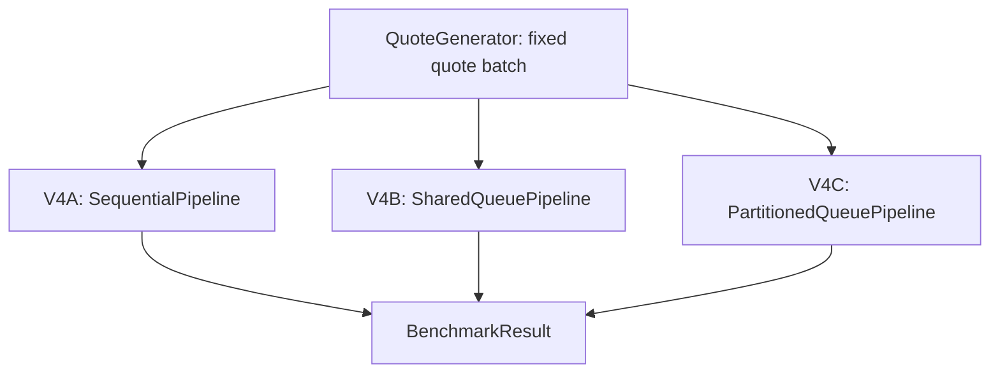

### V4A: SequentialPipeline

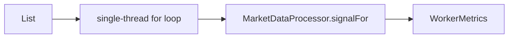

Purpose:

```text
Baseline. Measures processor cost without queue handoff or worker coordination.
```

What it tells us:

```text
For very tiny per-quote work, single-threaded processing can be fastest because there is no queue or thread handoff overhead.
```

### V4B: SharedQueuePipeline

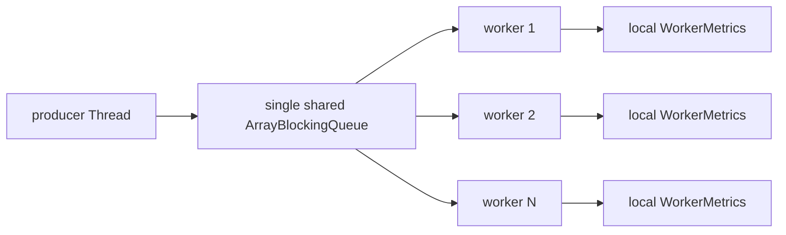

Purpose:

```text
Benchmark the cost of the intuitive shared-queue producer/consumer model.
```

What it tells us:

```text
The shared queue adds measurable queue wait and producer wait.
Multiple workers competing for the same queue increase coordination cost.
```

### V4C: PartitionedQueuePipeline

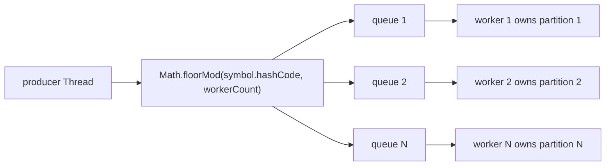

Purpose:

```text
Reduce shared queue contention and preserve per-symbol ordering.
```

Why it is stronger than the shared-queue version:

```text
Each worker has its own queue.
The same symbol always routes to the same worker.
Per-symbol ordering is easier to preserve.
Queue contention is usually lower than one shared queue.
```

Remaining trade-off:

```text
Load can become uneven if one symbol is much hotter than the others.
```

Benchmark measurement flow:


Measured fields:

```text
elapsed
throughput
avgE2E
p99E2E
avgQueue
avgProcessor
validate
decision
producerWait
signal counts
```

Metric meanings:

```text
elapsed
Total wall-clock time to run the whole batch.

avgE2E
Average per-message time from enqueue to processing completion.

p99E2E
99th percentile end-to-end latency.

avgQueue
Average time a message spends waiting between enqueue and worker processing.

avgProcessor
Average time spent inside validation plus decision logic.

validate
Average nanoseconds spent in QuoteValidator.

decision
Average nanoseconds spent in TradingDecisionEngine.

producerWait
Total time producer spent inside queue.put calls.
```

Important benchmark conclusion:

```text
For the current tiny decision engine, validation and decision are not the bottleneck.
The main latency increase comes from queue handoff, producer wait, and thread coordination.
```

Current benchmark interpretation:

```text
Sequential is fastest for tiny CPU-only work.
Shared queue is easy to understand but has high queue contention.
Partitioned queue reduces contention and preserves per-symbol ordering, but still pays queue handoff overhead.
```

Interview talking points:

```text
Measure before optimizing.
Concurrency is not free.
Parallelism only helps when the work justifies the coordination overhead.
Partitioning is important for ordering and state ownership in trading systems.
Benchmark module-level timing shows where latency is actually added.
```

## Future Version Recording Template

Copy this section when adding a new version.

```text
## Vx: Version Name

Status:
Current / Historical / Experimental

Code files:
file list

Design:
Mermaid diagram

Data flow:
step-by-step flow

Why this version exists:
reason

Strengths:
what improved

Weaknesses:
trade-offs and known issues

Benchmark impact:
what changed in elapsed, avgE2E, p99, avgQueue, avgProcessor

Interview talking points:
how to explain it
```

## V5: JCTools Queue Pipelines

Status:

```text
Current experimental dependency-backed queue optimization.
```

Dependency:

```text
org.jctools:jctools-core:4.0.3
```

Code files:

```text
pom.xml
JctoolsSpmcQueuePipeline.java
JctoolsSpscPartitionedPipeline.java
BenchmarkMain.java
```

Design overview:

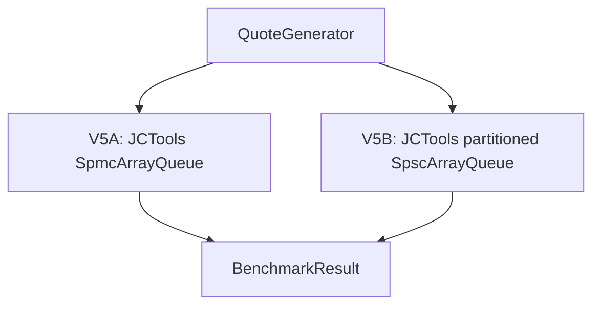

### V5A: JCTools SPMC Shared Queue

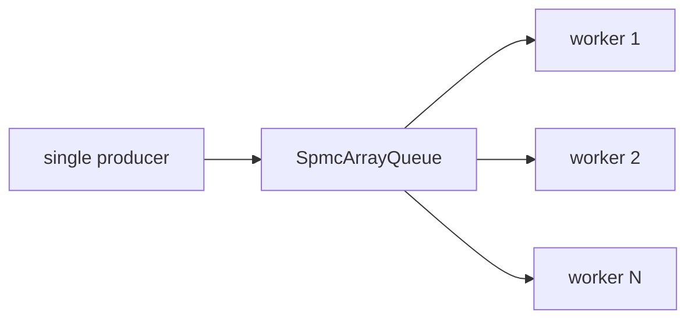

Purpose:

```text
Compare a JCTools single-producer/multi-consumer queue against Java ArrayBlockingQueue.
```

Strength:

```text
High throughput and low producer wait compared with ArrayBlockingQueue.
```

Weakness:

```text
All workers still share one queue.
In the measured run, average E2E latency stayed high because messages can sit in the shared queue while workers drain it.
This version is throughput-friendly but not the best latency version.
```

### V5B: JCTools SPSC Partitioned Queues

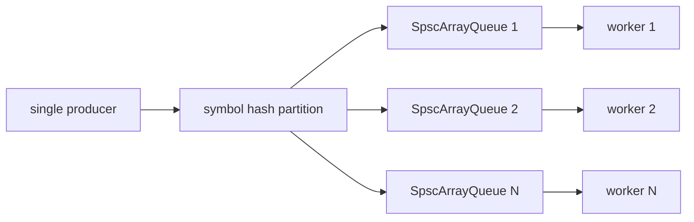

Purpose:

```text
Replace each partition's ArrayBlockingQueue with a single-producer/single-consumer JCTools queue.
```

Why it fits this project:

```text
The benchmark already showed queue handoff was the bottleneck.
The partitioned design naturally creates one producer and one consumer per queue.
That maps directly to SpscArrayQueue.
```

Strengths:

```text
Preserves per-symbol ordering.
Removes shared queue contention.
Reduces queue handoff latency compared with ArrayBlockingQueue partitioning.
Reduces producer wait substantially.
```

Weaknesses:

```text
Uses busy spinning with Thread.onSpinWait, so it can burn CPU.
Still uses object messages rather than preallocated ring-buffer slots.
Load can become uneven when one symbol is much hotter than others.
```

Benchmark impact from latest 200,000 quote run, last measured iteration:

```text
V3 partitioned ArrayBlockingQueue:
elapsed=70.47 ms avgE2E=89.82 us p99=335.42 us avgQueue=89.63 us producerWait=53.85 ms

V5 JCTools SPSC partitioned:
elapsed=26.81 ms avgE2E=8.64 us p99=172.65 us avgQueue=8.44 us producerWait=8.88 ms
```

Improvement versus V3 partitioned:

```text
elapsed down about 62.0%
avgE2E down about 90.4%
p99E2E down about 48.5%
avgQueue down about 90.6%
producerWait down about 83.5%
```

Interview talking points:

```text
We did not add JCTools blindly.
V4 showed queue handoff was the bottleneck.
V5 replaces the queue implementation while preserving the benchmark harness.
The best result came from matching the queue type to the ownership model: SPSC queue for one producer and one consumer per partition.
The SPMC shared queue improved throughput, but the partitioned SPSC version was much better for latency.
```

## Producer-Consumer Mechanics in V3

This section explains exactly how V3 implements the producer-consumer pattern.

Code files involved:

```text
Main.java
ConcurrentQuoteRunner.java
MarketDataFeed.java
QuoteWorker.java
QuoteEvent.java
QuoteMessage.java
StopMessage.java
ProcessingStats.java
MarketDataProcessor.java
```

High-level shape:

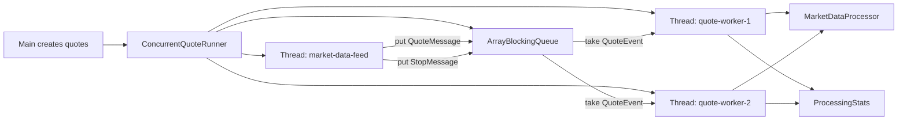

The producer:

```text
MarketDataFeed is the producer.
It implements Runnable, so it can run inside a Thread.
Its job is to publish QuoteEvent objects into the outbound queue.
```

Producer code shape:

```java
public final class MarketDataFeed implements Runnable {
    private final List<Quote> quotes;
    private final BlockingQueue<QuoteEvent> outbound;
    private final int workerCount;

    @Override
    public void run() {
        for (Quote quote : quotes) {
            outbound.put(new QuoteMessage(quote, System.nanoTime()));
        }
        for (int i = 0; i < workerCount; i++) {
            outbound.put(StopMessage.INSTANCE);
        }
    }
}
```

What this means:

```text
For every Quote, producer sends one QuoteMessage.
After all quotes are sent, producer sends one StopMessage per worker.
The queue is bounded, so outbound.put blocks if consumers are too slow.
That blocking behavior is the simple backpressure mechanism.
```

The queue:

```text
ConcurrentQuoteRunner creates a shared BlockingQueue<QuoteEvent>.
The concrete implementation is ArrayBlockingQueue.
```

Queue code shape:

```java
BlockingQueue<QuoteEvent> queue = new ArrayBlockingQueue<>(QUEUE_CAPACITY);
```

Why this matters:

```text
BlockingQueue is thread-safe.
Producer can call put from one thread.
Workers can call take from other threads.
ArrayBlockingQueue has fixed capacity, so it prevents unbounded memory growth.
```

The event types:

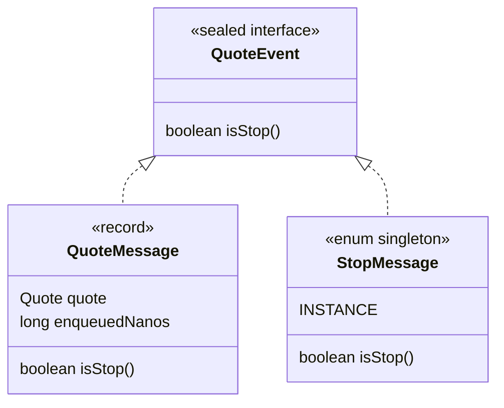

Why two event types exist:

```text
QuoteMessage means there is real market data to process.
StopMessage means the worker should exit its run loop.
```

The consumers:

```text
QuoteWorker is the consumer.
It implements Runnable, so each QuoteWorker can run inside a Thread.
Workers repeatedly take events from the queue.
```

Consumer code shape:

```java
public final class QuoteWorker implements Runnable {
    @Override
    public void run() {
        while (true) {
            QuoteEvent event = inbound.take();
            if (event.isStop()) {
                return;
            }

            QuoteMessage message = (QuoteMessage) event;
            TradingSignal signal = processor.signalFor(message.quote());
            stats.record(signal);
        }
    }
}
```

What this means:

```text
inbound.take blocks when the queue is empty.
Workers do not busy-spin in V3.
When a QuoteMessage arrives, worker processes it.
When a StopMessage arrives, worker returns from run(), ending the thread.
```

Thread startup and shutdown:

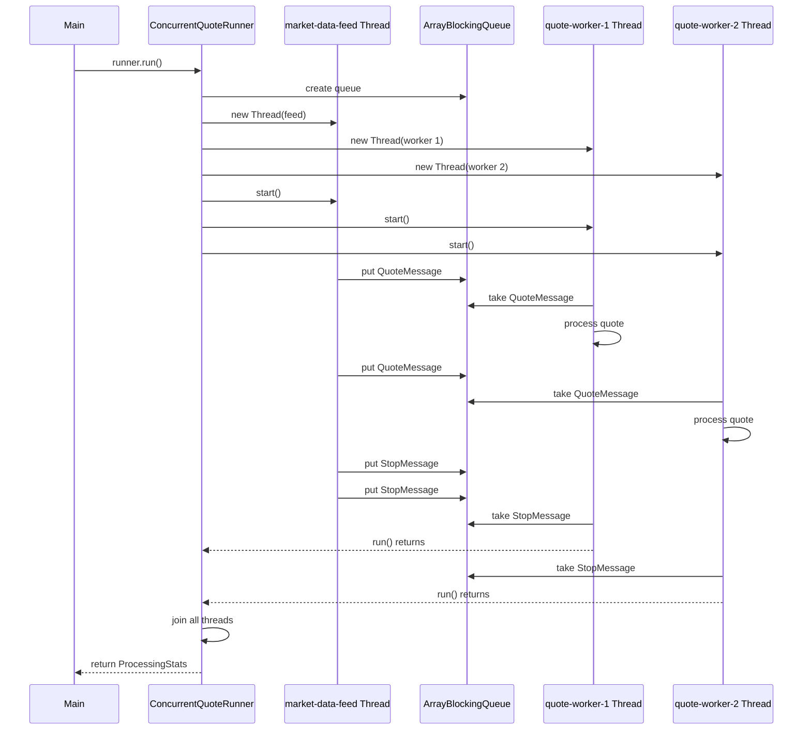

Why one StopMessage per worker:

```text
Each StopMessage is consumed by one worker.
If there are two workers, producer must send two StopMessages.
Otherwise one worker exits and the other may block forever on take().
```

The runner:

```text
ConcurrentQuoteRunner wires everything together.
It owns thread creation, start, and join.
```

Runner code shape:

```java
Thread feedThread = new Thread(feed.connectTo(queue, workerCount), "market-data-feed");

for (int i = 0; i < workerCount; i++) {
    Thread worker = new Thread(new QuoteWorker(i + 1, queue, processor, stats), "quote-worker-" + (i + 1));
}

for (Thread thread : threads) {
    thread.start();
}
for (Thread thread : threads) {
    thread.join();
}
```

What start and join do:

```text
start creates a new thread and executes run() asynchronously.
join makes the caller wait until that thread has finished.
```

V3 success condition:

```text
All QuoteMessage events are processed.
All workers receive StopMessage.
All threads exit.
Runner joins all threads.
ProcessingStats reports the expected count.
```

V3 limitations:

```text
All workers share one queue.
Workers compete for the same queue.
Per-symbol ordering is not guaranteed.
AtomicInteger stats are thread-safe but shared counters can become a contention point.
BlockingQueue is clear and correct, but queue handoff can dominate latency for tiny per-message work.
```

V3 interview summary:

```text
V3 implements producer-consumer by running MarketDataFeed as a producer thread, QuoteWorker instances as consumer threads, and using a bounded BlockingQueue<QuoteEvent> as the handoff point. QuoteMessage carries market data, StopMessage is the poison-pill shutdown signal, and ConcurrentQuoteRunner manages thread lifecycle with start and join.
```

## V6: Binance Live Quote Source

Status:

```text
Current live-data import version.
```

Purpose:

```text
Replace purely synthetic quote input with a public WebSocket market-data source for replay/demo use.
This is not part of the latency benchmark hot path.
```

Dependencies:

```text
Java standard HttpClient WebSocket API
com.fasterxml.jackson.core:jackson-databind:2.17.2
```

Code files:

```text
QuoteSource.java
BinanceBookTickerSource.java
BinanceReplayMain.java
scripts/binance.sh
pom.xml
```

Design:

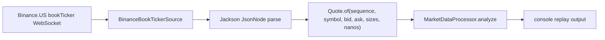

Data mapping:

```text
Binance field s -> Quote.symbol
Binance field b -> Quote.bidPrice ticks
Binance field B -> Quote.bidSize
Binance field a -> Quote.askPrice ticks
Binance field A -> Quote.askSize
local counter   -> Quote.sequenceNumber
System.nanoTime -> Quote.receivedNanos
```

Endpoint behavior:

```text
Binance global stream endpoint returned HTTP 451 in this environment.
The default source now uses Binance.US: wss://stream.binance.us:9443/stream?streams=
The global endpoint is still defined in code for environments where it is allowed.
```

Why WebSocket data is separate from benchmark data:

```text
Live network ingestion includes internet latency, exchange/API behavior, JSON parsing, and WebSocket client overhead.
Those are useful for replay/demo, but they should not be mixed with queue/processor latency benchmark results.
```

Interview talking points:

```text
QuoteSource abstracts where market data comes from.
BinanceBookTickerSource normalizes external JSON into the internal Quote model.
Network/API ingestion is separated from hot-path pipeline benchmarking.
The design can later support CSV replay, Alpaca, Coinbase, or a binary feed without rewriting the processor.
```

## V7: Live Binance Pipeline Latency Breakdown

Status:

```text
Current live pipeline latency measurement version.
```

Purpose:

```text
Integrate live Binance.US bookTicker data with a processing pipeline while measuring each stage separately.
This complements the synthetic benchmark instead of replacing it.
```

Code files:

```text
BinanceBookTickerParser.java
LiveQuoteEnvelope.java
LiveLatencyStats.java
BinanceLivePipelineMain.java
scripts/binance-latency.sh
```

Design:

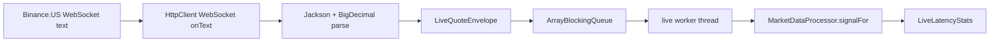

Measured stages:

```text
parse latency
raw WebSocket text received locally -> JSON parsed and Quote created

queue latency
Quote envelope enqueued -> worker starts processing

processor latency
worker starts processing -> MarketDataProcessor.signalFor returns

local E2E latency
raw WebSocket text received locally -> worker processing complete

producer offer time
time spent offering messages into the queue
```

Important limitation:

```text
Binance bookTicker payload does not include an exchange event timestamp.
Therefore true exchange-to-local network latency is not measured.
The live pipeline measures local ingress latency from the moment Java receives WebSocket text.
```

Why this version matters:

```text
It is closer to a real trading system because it includes live network ingestion, JSON parsing, queue handoff, and processing.
It also shows why synthetic benchmark and live pipeline benchmark should be kept separate: they answer different questions.
```

Example result:

```text
loaded live Binance.US bookTicker messages=10 symbols=[BTCUSDT, ETHUSDT]
networkLatency=not-measured bookTicker has no exchange event timestamp
live-latency processed=10 parseAvg=2818.40us parseP99=24842.09us queueAvg=293.78us queueP99=578.90us processorAvg=44.15us processorP99=327.00us localE2EAvg=3156.48us localE2EP99=25746.17us producerOffer=0.83ms signals[B=0 S=0 N=0 X=10]
```

Current interpretation:

```text
JSON and BigDecimal parsing dominate the measured live path.
The processor is much smaller than parsing.
This is realistic: external text protocols are convenient, but not low-latency optimal.
A later optimization could parse decimals manually, avoid BigDecimal, or move toward binary/SBE-style messages.
```

## V8: Actual Exchange-Time Pipeline

Status:

```text
Current real-market-data latency version.
```

Purpose:

```text
Measure a live path from Binance exchange event timestamp to local Java processing completion.
Store the actual received market-data messages locally for later inspection and replay work.
```

Code files:

```text
ActualMarketDataRecord.java
ActualLatencyEnvelope.java
ActualLatencyStats.java
BinanceTickerParser.java
BinanceActualLatencyMain.java
scripts/binance-actual-latency.sh
data/binance-actual-*.jsonl
```

Design:

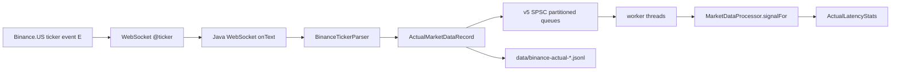

Measured stages:

```text
exchToRecv: exchange event timestamp E -> local WebSocket receipt
exchToDone: exchange event timestamp E -> local processor completion
parse: local raw WebSocket receipt -> Quote creation
queue: enqueue -> worker starts processing
processor: MarketDataProcessor.signalFor runtime
localE2E: local raw WebSocket receipt -> processor completion
```

Default queue mode:

```text
v5-spsc
```

Reason:

```text
The live WebSocket callback is a single producer. Partitioning by symbol into SPSC queues keeps per-symbol order and gives each worker clear queue ownership.
```

## V9: Depth Order Book Pipeline

Status:

```text
Current richer market-data version.
```

Purpose:

```text
Use Binance.US depth diff stream instead of one-level ticker data.
Maintain a local order book and pass top 10 levels into the processor.
Make the decision logic use top 5 and top 10 liquidity, not only best bid/ask.
```

Code files:

```text
OrderBookLevel.java
DepthUpdate.java
DepthBookTop.java
LocalOrderBook.java
DepthMarketDataRecord.java
BinanceDepthParser.java
DepthDecisionEngine.java
DepthMarketDataProcessor.java
DepthLatencyEnvelope.java
DepthLatencyStats.java
BinanceDepthLatencyMain.java
scripts/binance-depth-latency.sh
```

Design:

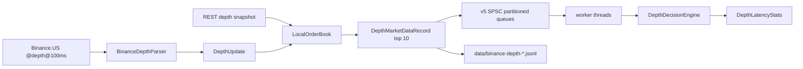

Decision inputs:

```text
top spread: ask1 - bid1
level 5 imbalance: sum bid size 1..5 / sum ask size 1..5
level 10 imbalance: sum bid size 1..10 / sum ask size 1..10
weighted spread 5: weighted ask 1..5 - weighted bid 1..5
weighted spread 10: weighted ask 1..10 - weighted bid 1..10
```

Measured stages:

```text
parse: raw JSON -> DepthUpdate
book: apply update to LocalOrderBook and extract top 10
queue: enqueue -> worker starts processing
processor: DepthDecisionEngine evaluation
localE2E: local WebSocket receipt -> processor complete
```

## V10: Disruptor Framework Compare

Status:

```text
Current framework comparison version.
```

Purpose:

```text
Compare the existing v5 SPSC queue design against an LMAX Disruptor ring-buffer design using the same live depth events.
The WebSocket, JSON parse, and LocalOrderBook update happen once; the resulting DepthMarketDataRecord is published to both pipelines.
```

Code files:

```text
DepthPipeline.java
SpscDepthPipeline.java
DisruptorDepthEvent.java
DisruptorDepthPipeline.java
BinanceDepthFrameworkCompareMain.java
scripts/binance-depth-compare.sh
pom.xml
```

Design:

```mermaid
flowchart LR
    WS["Binance.US @depth@100ms"] --> Parser["parse DepthUpdate"]
    Parser --> Book["LocalOrderBook top 10"]
    Book --> Record["DepthMarketDataRecord"]
    Record --> SPSC["v5-depth-spsc queues"]
    Record --> Disruptor["v10-depth-disruptor ring buffers"]
    SPSC --> ProcessorA["DepthDecisionEngine"]
    Disruptor --> ProcessorB["DepthDecisionEngine"]
    ProcessorA --> StatsA["DepthLatencyStats"]
    ProcessorB --> StatsB["DepthLatencyStats"]
```

Comparison rule:

```text
Both pipelines process the same actual market-data records from the same live run.
This compares pipeline framework overhead and processor timing, not different market conditions.
```

Framework detail:

```text
v5-depth-spsc: one JCTools SpscArrayQueue per partition/worker.
v10-depth-disruptor: one LMAX Disruptor ring buffer per partition/worker, single producer, busy-spin wait strategy.
```

## V11: Raw Depth Disruptor Pipeline

Status:

```text
Current test of Disruptor controlling the local pipeline from raw market data onward.
```

Purpose:

```text
Move parse, book update, and decision out of the WebSocket callback and into a Disruptor handler chain.
The callback only assembles the raw JSON message, extracts the symbol for routing, and publishes RawDepthPayload into the ring buffer.
```

Code files:

```text
RawDepthPayload.java
RawDepthDisruptorEvent.java
RawDepthLatencyStats.java
RawDisruptorDepthPipeline.java
BinanceRawDisruptorDepthMain.java
scripts/binance-depth-raw-disruptor.sh
```

Design:

```mermaid
flowchart LR
    WS["Binance.US @depth@100ms"] --> Callback["WebSocket callback"]
    Callback --> Raw["RawDepthPayload"]
    Raw --> Ring["Disruptor ring buffer per symbol partition"]
    Ring --> Parse["ParseHandler: raw JSON -> DepthUpdate"]
    Parse --> Book["BookUpdateHandler: LocalOrderBook top 10"]
    Book --> Decision["DecisionHandler: top5/top10 signal"]
    Decision --> Stats["RawDepthLatencyStats"]
    Raw --> Jsonl["data/binance-raw-disruptor-*.jsonl"]
```

Measured stages:

```text
queue: callback publish -> ParseHandler starts
parse: ParseHandler JSON parse
book: BookUpdateHandler apply depth update and extract top 10
processor: DecisionHandler strategy logic
localE2E: local WebSocket receipt -> DecisionHandler complete
```

Important design note:

```text
Each partition has a three-stage handler chain: parse -> book -> decision.
With four partitions this creates more active threads than the simple SPSC version.
That is useful for modeling a richer trading pipeline, but it is not automatically lower latency for small per-event work.
```

## V12: Custom Multi-Exchange WebSocket Adapters

Status:

```text
Current custom multi-exchange market-data validation version.
```

Purpose:

```text
Replace Coinbase with OKX and validate three custom WebSocket adapters against REST snapshots and XChange where available.
The main realtime path is WebSocket. REST is only used for snapshot validation.
```

Exchanges:

```text
Binance.US: WebSocket depth5@100ms, REST bookTicker, XChange baseline available.
OKX: WebSocket books5, REST market/books, no XChange baseline configured.
Kraken: WebSocket v2 book, REST Depth, XChange baseline available.
```

Code files:

```text
CustomWebSocketTopOfBookAdapter.java
AbstractWebSocketTopOfBookAdapter.java
BinanceUsBookTickerWebSocketAdapter.java
OkxBooks5WebSocketAdapter.java
KrakenBookWebSocketAdapter.java
OkxTopOfBookAdapter.java
CustomWebSocketVsBaselineTopOfBookMain.java
scripts/custom-ws-vs-baseline.sh
```

Design:

```mermaid
flowchart LR
    BinanceWS["Binance.US depth5@100ms"] --> Canonical["TopOfBookSnapshot"]
    OkxWS["OKX books5"] --> Canonical
    KrakenWS["Kraken book snapshot"] --> Canonical
    Canonical --> Compare["Compare bid/ask with REST/XChange"]
    BinanceRest["Binance.US REST bookTicker"] --> Compare
    OkxRest["OKX REST market/books"] --> Compare
    KrakenRest["Kraken REST Depth"] --> Compare
    XChange["XChange baseline where supported"] --> Compare
```

Validation rule:

```text
WebSocket is the realtime source.
REST/XChange snapshots are sampled after the WebSocket snapshot, so small price/size differences are normal in moving markets.
Exact bid/ask price matches are strong evidence that the parser is correct.
```

## V13: Package-Level Modular Refactor

Status:

```text
Current source organization version.
```

Purpose:

```text
Move the project from one flat Java package into package-level modules that match trading-system responsibilities.
No behavior change is intended in this version.
```

Package layout:

```text
com.example.hft.app                 runnable entry points
com.example.hft.exchange            adapter contracts and shared adapter base classes
com.example.hft.exchange.binance    Binance.US adapters/parsers
com.example.hft.exchange.okx        OKX adapters
com.example.hft.exchange.kraken     Kraken adapters
com.example.hft.exchange.coinbase   Coinbase experimental adapters
com.example.hft.marketdata.model    quotes, depth updates, top-of-book snapshots, envelopes
com.example.hft.marketdata.source   quote/data source helpers
com.example.hft.pipeline            queues, Disruptor pipelines, latency stats
com.example.hft.strategy            validators and decision engines
com.example.hft.benchmark           benchmark/timing result helpers
```

Design boundary:

```mermaid
flowchart LR
    App["app"] --> Exchange["exchange adapters"]
    Exchange --> Model["marketdata.model"]
    Model --> Pipeline["pipeline"]
    Pipeline --> Strategy["strategy"]
    Strategy --> Stats["benchmark/stats output"]
```

Reason:

```text
The active data sources are Binance.US, OKX, and Kraken.
Exchange-specific code now lives in exchange-specific packages.
Shared market-data objects and pipeline code are separated from runnable app entry points.
```

## V14: Data Source Module Refactor

Status:

```text
Current code introduces a datasource abstraction and wraps the active top-of-book WebSocket/REST adapters behind it.
```

Purpose:

```text
Move from app-level direct adapter calls toward a professional market-data ingestion design:
source protocol -> transport -> raw message -> normalizer -> sequencer/book quality -> local books -> strategy.
```

Local colored diagram:

```text
docs/data-source-diagram.md
```

Implemented package boundary:

```text
com.example.hft.datasource              connector, subscription, sink, health/status
com.example.hft.datasource.transport    transport type and raw inbound message
com.example.hft.datasource.normalizer   canonical market-data events
com.example.hft.datasource.book         sequencing and book quality checks
```

Design:

```mermaid
flowchart LR
    REST["REST snapshot/meta"] --> Connector["MarketDataConnector"]
    WS["WebSocket live feed"] --> Connector
    FIX["Future FIX feed"] -.-> Connector
    Third["Third-party provider"] -.-> Connector
    Replay["Replay files"] -.-> Connector
    Connector --> Raw["RawInboundMessage"]
    Raw --> Normalized["NormalizedMarketDataEvent"]
    Normalized --> Quality["BookSequencer / BookQuality"]
    Quality --> Books["LocalOrderBook per exchange + symbol"]
    Books --> View["CrossExchangeMarketView"]
    View --> Strategy["Strategy pipeline"]
```

Why this version matters:

```text
The app no longer needs to know whether an exchange is implemented by a specific WebSocket adapter class.
It can ask a MarketDataConnector for realtime top-of-book data and optional REST snapshot validation.
This creates the extension point for FIX, third-party providers, and replay without rewriting strategy code.
```
## V15: Reference-Inspired Data Module Cleanup

Status:

```text
Adds instrument metadata, data engine/cache/event bus, and replay skeletons based on common patterns in Hummingbot, NautilusTrader, XChange, and CCXT.
```

Improved local image:

```text
docs/data-source-architecture.png
docs/data-source-architecture.svg
```

Design influence:

```text
Hummingbot: connector + order-book data source + order-book tracker.
NautilusTrader: adapter/data client -> DataEngine -> cache -> message bus -> strategy.
XChange / CCXT: stable unified API facade over many exchange implementations.
```

Implemented package additions:

```text
com.example.hft.datasource.instrument   Instrument, InstrumentProvider, SymbolMapper
com.example.hft.datasource.engine       MarketDataEngine, MarketDataCache, MarketDataEventBus
com.example.hft.datasource.replay       RecordingMarketDataSink, ReplayMarketDataSource
```

Current high-level flow:

```mermaid
flowchart LR
    Source["Exchange / Provider / Replay"] --> Connector["MarketDataConnector"]
    Connector --> Client["MarketDataClient"]
    Client --> Raw["RawInboundMessage"]
    Raw --> Normalize["Parser / Normalizer"]
    Normalize --> Engine["MarketDataEngine"]
    Engine --> Cache["MarketDataCache"]
    Engine --> Bus["MarketDataEventBus"]
    Bus --> Book["BookCoordinator / LocalOrderBooks"]
    Book --> View["CrossExchangeMarketView"]
    View --> Strategy["Strategy / Benchmark"]
    Engine -.-> Recorder["Recorder"]
    Recorder -.-> Source
```
## V16: Data Engine Runtime Wiring

Status:

```text
Current active multi-exchange validation path now uses MarketDataConnector.subscribe, MarketDataEngine, MarketDataCache, MarketDataEventBus, RecordingMarketDataSink, and SymbolMapper.
```

Runtime flow:

```mermaid
flowchart LR
    Connector["MarketDataConnector.subscribe"] --> Fanout["FanoutMarketDataSink"]
    Fanout --> Engine["MarketDataEngine"]
    Fanout --> Recorder["RecordingMarketDataSink"]
    Engine --> Cache["MarketDataCache"]
    Engine --> Bus["MarketDataEventBus"]
    Cache --> Compare["REST / XChange comparison"]
    Bus --> Listener["strategy/benchmark listener"]
    Recorder -.-> Replay["future replay input"]
    SymbolMapper["SymbolMapper"] --> Compare
```

Behavioral difference from V14/V15:

```text
V14 wrapped adapters as connectors.
V15 added reference-inspired instrument, engine, cache, bus, and replay skeletons.
V16 makes the main live validation app use those pieces instead of bypassing them.
```
## V17: Raw Depth To Local Order Book

Status:

```text
Current active depth-book path records Binance.US raw WebSocket depth messages, anchors them to REST snapshots, validates sequence continuity, and applies valid deltas to local order books.
```

Local image:

```text
docs/raw-depth-order-book-v17.svg
```

Runtime flow:

```mermaid
flowchart LR
    WS["Binance.US WebSocket depth@100ms"] --> Queue["RawDepthPayload queue"]
    Queue --> RawFile["raw JSONL recorder"]
    Queue --> Parser["BinanceDepthParser"]
    REST["REST depth snapshot limit=5000"] --> Book["SequencedLocalOrderBook"]
    Parser --> Seq["U/u sequence gate"]
    Seq --> Book
    Book --> Events["book event JSONL"]
    Book --> Summary["summary JSON + console metrics"]
    RawFile -. replay .-> Parser
```

Key sequence rule:

```text
Open WebSocket first and buffer raw events.
Fetch REST snapshot after the stream is open.
Drop stale events where u <= snapshot lastUpdateId.
The first applied event must bridge snapshot lastUpdateId + 1.
After bootstrap, each event must continue from previous final update id + 1.
```

Why V17 matters:

```text
V16 proved the top-of-book datasource engine wiring.
V17 starts the real depth-book layer: raw exchange data becomes a maintained local order book with gap/stale/crossed quality metrics.
This is the correct foundation before strategy, arbitrage, or order routing logic.
```
## V18: Automatic Reconnect And Resync

Scope:

```text
Only step 1 production hardening: recover the Binance.US raw-depth local book path after stream errors or invalid book state.
```

Flow:

```mermaid
flowchart LR
    WS["Binance.US depth WebSocket"] --> Raw["RawDepthPayload queue"]
    Raw --> Parser["BinanceDepthParser"]
    Parser --> Book["SequencedLocalOrderBook"]
    Book -->|APPLIED/STALE| Continue["continue"]
    Book -->|GAP/CROSSED| Snapshot["REST depth snapshot"]
    Snapshot --> Reset["book.loadSnapshot"]
    Reset --> Continue
    WS -->|onError| Reconnect["connect new WebSocket"]
    Reconnect --> SnapshotAll["reload snapshots for all symbols"]
    SnapshotAll --> Continue
```
## V19: Multi-Exchange Deep Book Source Catalog

```mermaid
flowchart LR
    Catalog["DeepBookSourceCatalog"] --> Binance["Binance.US\nREST depth 5000 + WS depth@100ms"]
    Catalog --> OKX["OKX\npublic books 400 levels"]
    Catalog --> Kraken["Kraken\npublic book 1000 levels"]
    Binance --> Validate["DeepBookSourceDiscoveryMain"]
    OKX --> Validate
    Kraken --> Validate
    Validate --> Output["deep-book-sources-v19 JSONL\nsource health + level counts + sequence/checksum fields"]
```

Design note:

```text
The data-source layer now knows where to get deeper books from multiple exchanges.
This is intentionally separate from the local book builder because each exchange has different sequencing and integrity rules.
```