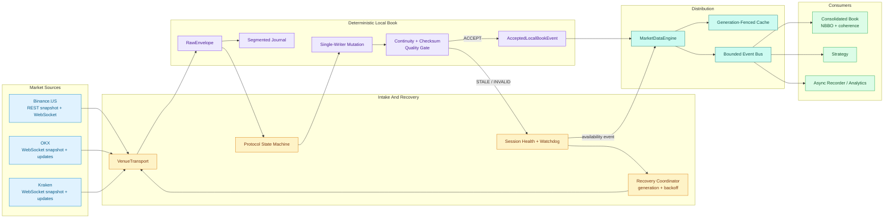

# Current Architecture Diagram

Release `1.0.0` has one canonical architecture. The rendered image is [docs/architecture.svg](docs/architecture.svg); detailed module images are under `docs/modules/`.

The critical rule is fail closed: leaving `LIVE` immediately tombstones the source in cache and removes it from consolidated state. Only an accepted event from the current generation can make the source usable again.