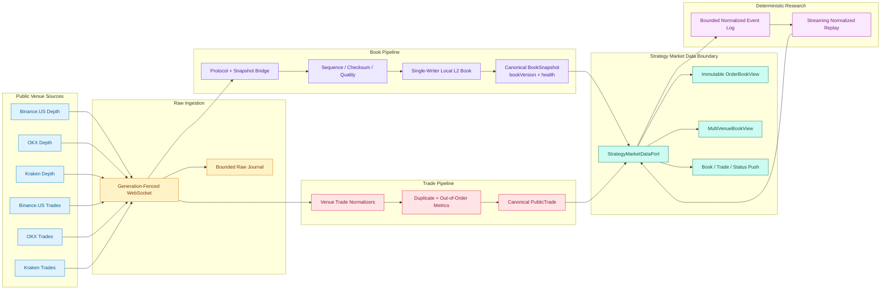

# Current Architecture Diagram

Release `1.1.0` has one canonical architecture. The rendered image is [docs/architecture.svg](docs/architecture.svg).

The pipeline publishes data only. Arbitrage, market making, Alpha, fair value, execution, positions, and risk remain downstream and out of scope.