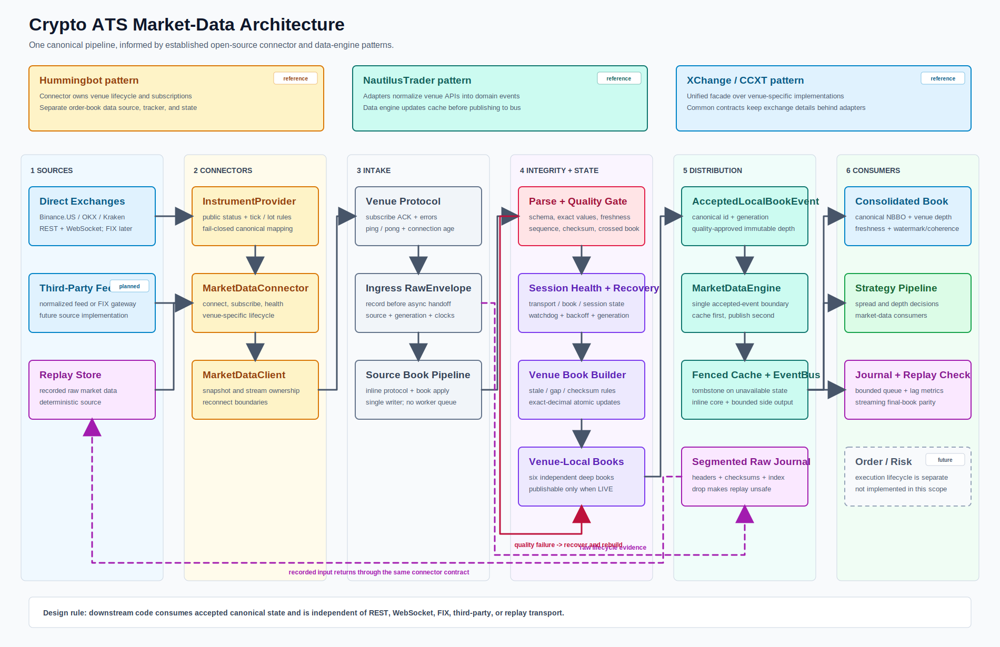

# Architecture

Release `1.1.0` extends the validated single-writer book pipeline through a stable strategy-facing market-data boundary.



## Current Data Flow

```text
Depth REST/WebSocket
  -> RawEnvelope and raw journal
  -> protocol / generation / recovery
  -> venue sequence and checksum validation
  -> single-writer local L2 book
  -> immutable canonical BookSnapshot

Public Trade WebSocket
  -> venue PublicTradeNormalizer
  -> duplicate/out-of-order checks
  -> canonical PublicTrade

BookSnapshot + PublicTrade + BookStatusChange
  -> MarketDataEngine
  -> StrategyMarketDataPort state update
  -> push notification
  -> normalized event log
```

## Canonical Identity And Time

Binance `BTCUSDT`, OKX `BTC-USDT`, and Kraken `BTC/USDT` map to `InstrumentId("BTC-USDT")`. Every canonical event carries venue, venue symbol, source/local sequence, stream epoch, exchange time, receive wall time, receive monotonic time, publish monotonic time, and schema version. Exchange clocks are retained for audit and are not treated as synchronized across venues.

## Strategy-Facing Semantics

Pull consumers use immutable `OrderBookView` and `MultiVenueBookView`. Push consumers receive `BookUpdateNotification`, `PublicTrade`, and `BookStatusChange`. Updating state always precedes notification.

Multi-venue data means latest observed state per venue. Each component retains its own version, health, age, timestamps, and depth; it is not described as a simultaneous global snapshot and contains no arbitrage calculation.

## Failure Semantics

GAP, CHECKSUM_FAILED, STALE, RECOVERING, DISCONNECTED, and INVALID are explicit. Cache and port updates are fenced by stream epoch. Old callbacks cannot restore an invalidated source; only a valid accepted book from the current/new epoch returns it to LIVE.

## Recording

The raw journal supports production diagnosis and re-normalization. The normalized log records the exact canonical book, trade, and status sequence accepted by `StrategyMarketDataPort`. Streaming replay rebuilds the same bookVersion, health, top-N state, and latest trade.

## Out Of Scope

No strategy, feature model, fair value, maker/taker selection, OMS, execution, position, account, or private feed is implemented.