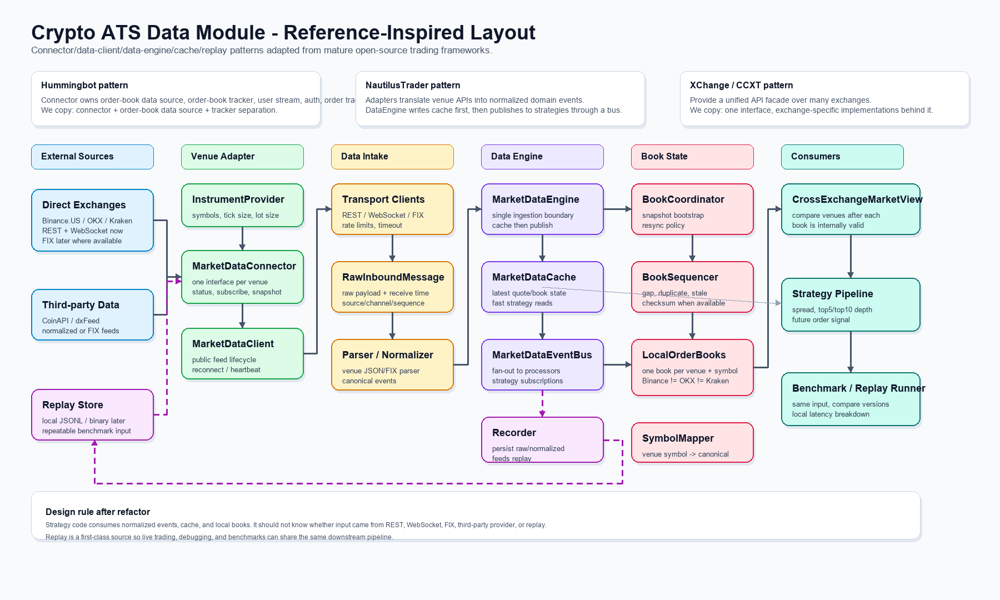
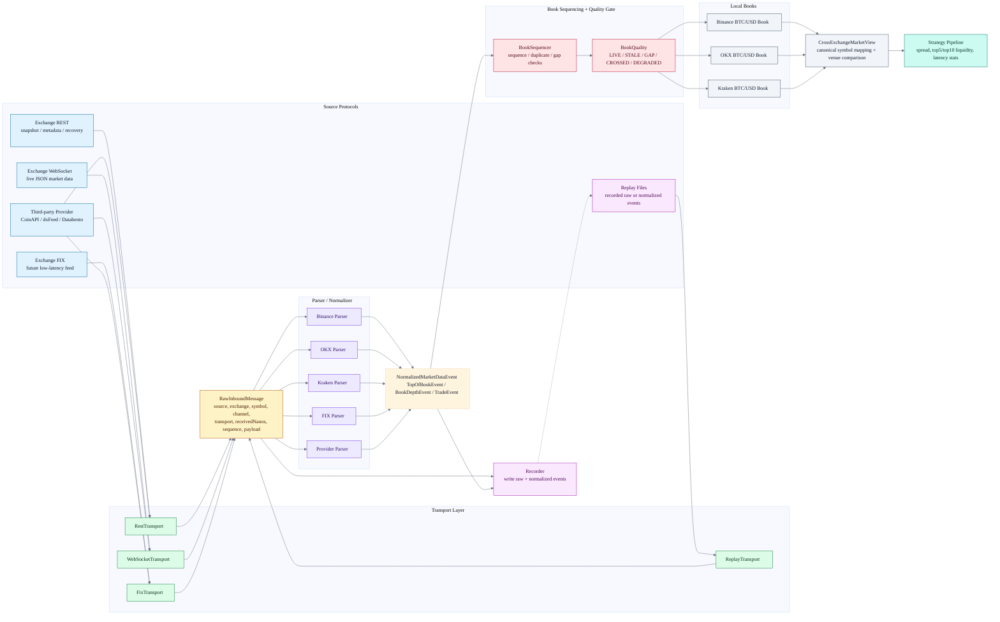

# Data Source Module Diagram

This is the V15 reference-inspired shape for the data-source module. The PNG/SVG image uses aligned columns and orthogonal arrows to show external sources, venue adapter, data intake, data engine, book state, and consumers.

Actual image files:

```text
docs/data-source-architecture.png
docs/data-source-architecture.svg
```





