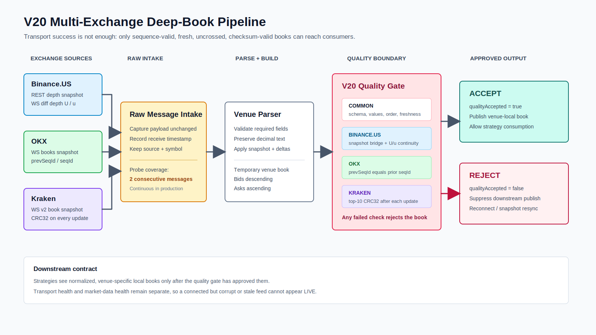
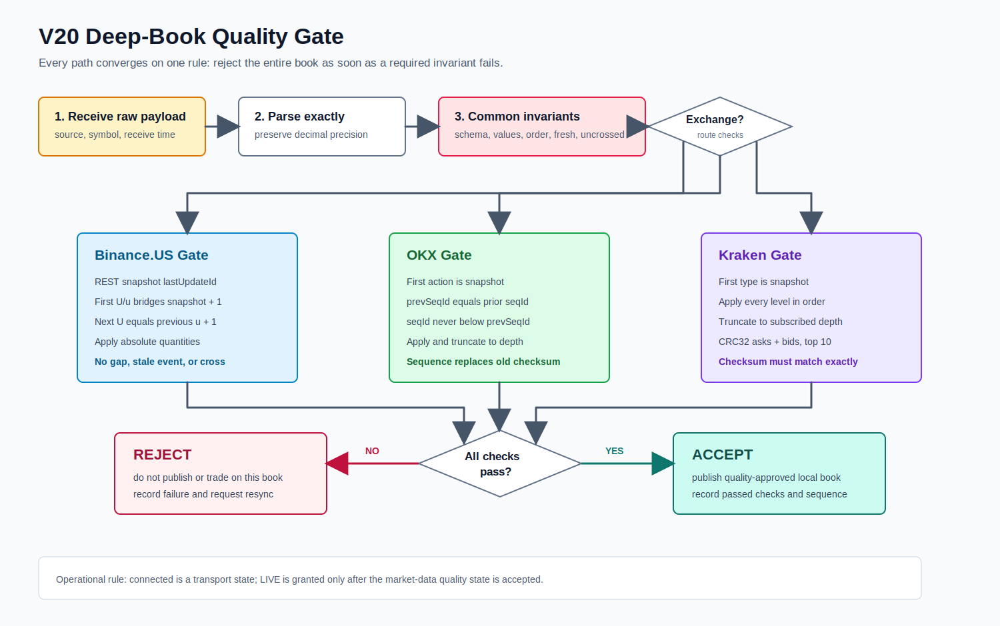
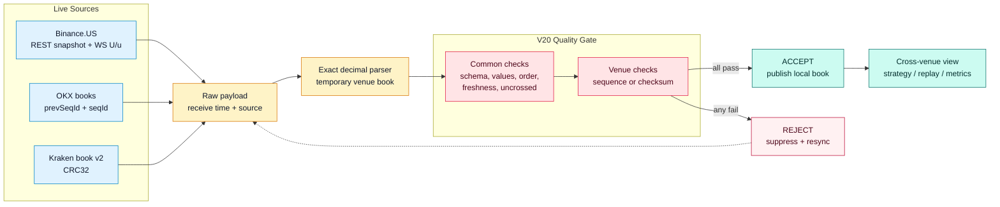

# Data Source Module Diagrams

The current design is V20. It adds an explicit market-data quality boundary between venue parsing and downstream local-book publication.

## V20 Pipeline



## V20 Quality Gate



Detailed rules, failure behavior, source references, and output fields are documented in [data-quality-v20.md](data-quality-v20.md).



## Earlier Reference Diagram

The broader V15 connector/data-engine/cache/replay reference remains available:

```text
docs/data-source-architecture.png
docs/data-source-architecture.svg
```

V20 does not remove those boundaries. It makes the previously conceptual `BookSequencer + BookQuality` block executable and venue-specific.
