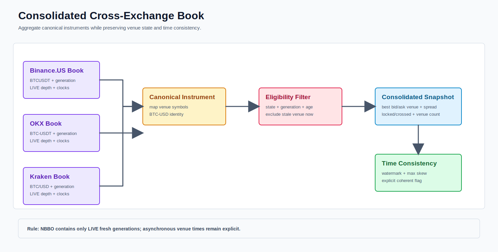

# Cross-Exchange Market View Module



PNG fallback: [cross-exchange-view.png](cross-exchange-view.png)

The view compares independently validated venue books through a canonical instrument identity.

## Input Rules

Each input keeps:

```text
venue identity
venue and canonical symbol
quality/lifecycle state
exchange timestamp
local receive timestamp
top levels and configured depth
```

Stale or degraded books are excluded from actionable comparisons, but remain visible to monitoring. The view does not mutate source books and does not hide which venue supplied a price.

## Current Scope

Top-of-book comparison exists for the current exchanges. A full deep-book view will aggregate comparable depth metrics while preserving separate source books.
