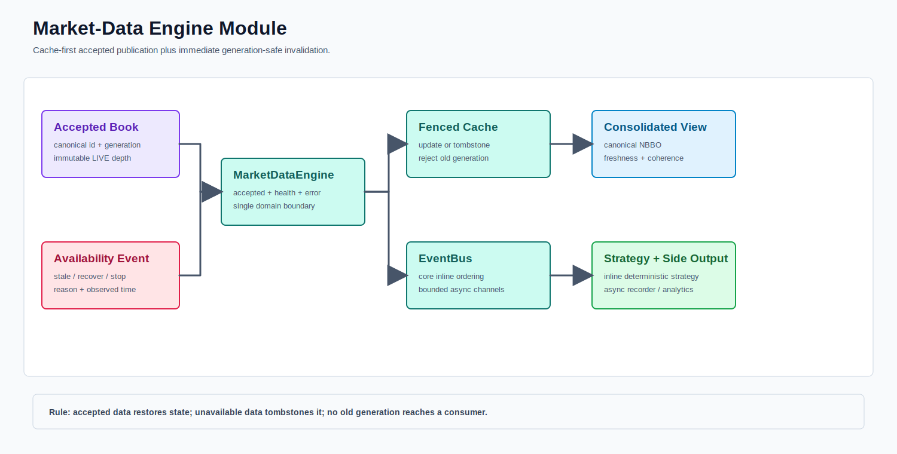

# Market-Data Engine Module



PNG fallback: [data-engine.png](data-engine.png)

The engine is the accepted-event boundary between validated state and downstream subscribers.

## Ordering Contract

```text
accepted canonical event
  -> MarketDataEngine
  -> update MarketDataCache
  -> publish through MarketDataEventBus
  -> listeners read coherent latest state
```

Cache-first ordering matters because an event-bus listener may immediately query the latest state. Publishing before the cache update would expose two conflicting views of the same event.

## Current Code

```text
src/main/java/com/example/hft/datasource/engine/
  MarketDataEngine.java
  MarketDataCache.java
  MarketDataEventBus.java
  MarketDataListener.java
```
