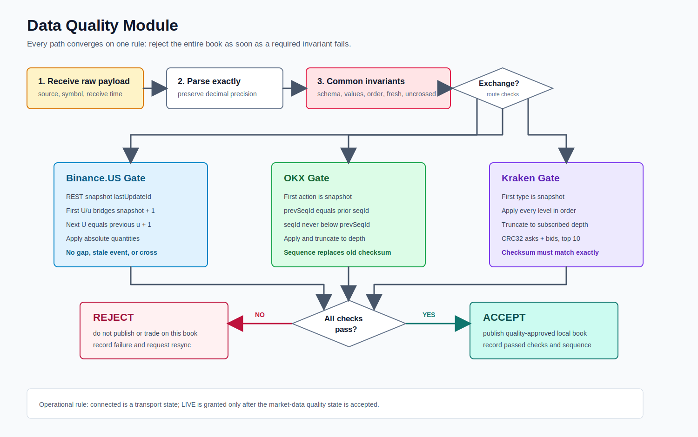

# Data Quality

Quality checks cover schema, finite positive prices, nonnegative quantities, sorted sides, sequence continuity, venue checksum where available, crossed books, freshness, and current generation.

Only `ACCEPT/APPLIED` data can become an `AcceptedLocalBookEvent`. Bootstrapping, stale, rejected, gap, checksum failure, crossed, degraded, and old-generation data are not published to strategy.