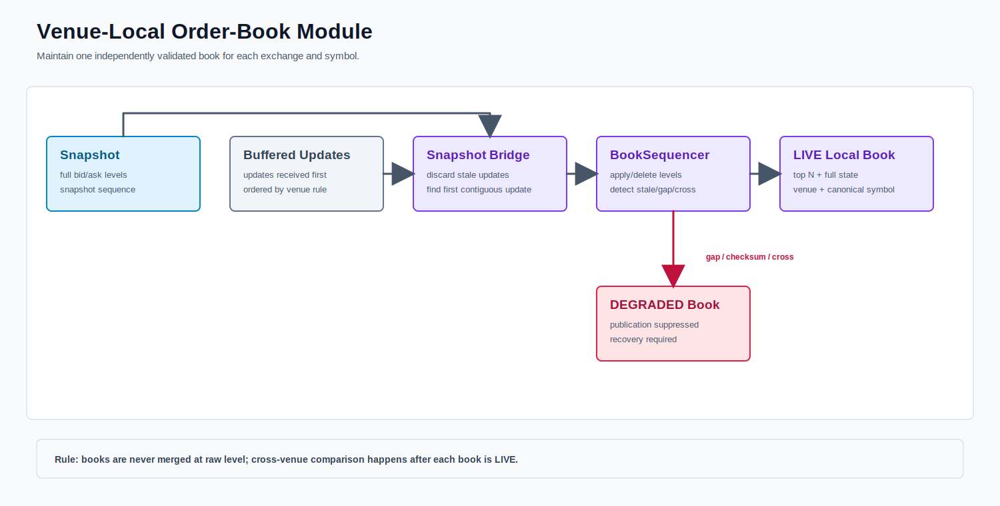

# Venue-Local Order-Book Module



PNG fallback: [order-book.png](order-book.png)

## Ownership

Each `exchange + symbol` has an independent exact-decimal builder, health state, generation, and recovery lifecycle. Raw books are never merged.

```text
Binance.US: BTCUSDT, ETHUSDT
OKX:        BTC-USDT, ETH-USDT
Kraken:     BTC/USD, ETH/USD
```

## Builder And Publication Contract

```text
LocalOrderBookBuilder
  loadSnapshot(payload, receivedTime)
  onMessage(payload, receivedTime)
  snapshot(levels)
  quality()
  reset()

BookUpdateResult ACCEPT/APPLIED + LIVE
  -> SessionHealth publication gate
  -> AcceptedLocalBookEvent
  -> MarketDataEngine
```

`LocalOrderBookBuilderFactory` hides venue-specific implementations from `LiveBookSession`. `MutableDecimalOrderBook` parses all changes before mutation, applies insert/update/delete atomically under session ordering, and detects crossed state.

## Venue Continuity

| Venue | Bootstrap and update rule |
|---|---|
| Binance.US | Buffer WebSocket diffs, record/load REST snapshot, find the `U/u` bridge, then require contiguous updates. |
| OKX | Apply WebSocket `snapshot`, then require `prevSeqId == previous seqId`. |
| Kraken | Apply WebSocket `snapshot`, require non-decreasing timestamps, and validate CRC32 after every message. |

A gap, checksum failure, crossed book, parse failure, stale source, or non-live session suppresses publication and requests source-local recovery.

## Latest Live Validation

Command:

```bash
./scripts/multi-exchange-local-books.sh 8 data 10
```

Result on 2026-07-23:

```text
sources=6 publishableBooks=6 messages=984 published=965 rejected=0
reconnectAttempts=0 deepBookCache=6 eventRecorder=965
recordedRecords=1006 droppedRecords=0 replaySafe=true replayParity=true
```

The duration is only the smoke window. The third argument is the no-message stale threshold in seconds.

## Current Code

```text
runtime/LocalOrderBookBuilder.java
runtime/BinanceLocalOrderBookBuilder.java
runtime/OkxLocalOrderBookBuilder.java
runtime/KrakenLocalOrderBookBuilder.java
runtime/MutableDecimalOrderBook.java
runtime/LiveBookSession.java
runtime/LocalBookPublisher.java
runtime/AcceptedLocalBookEvent.java
```
