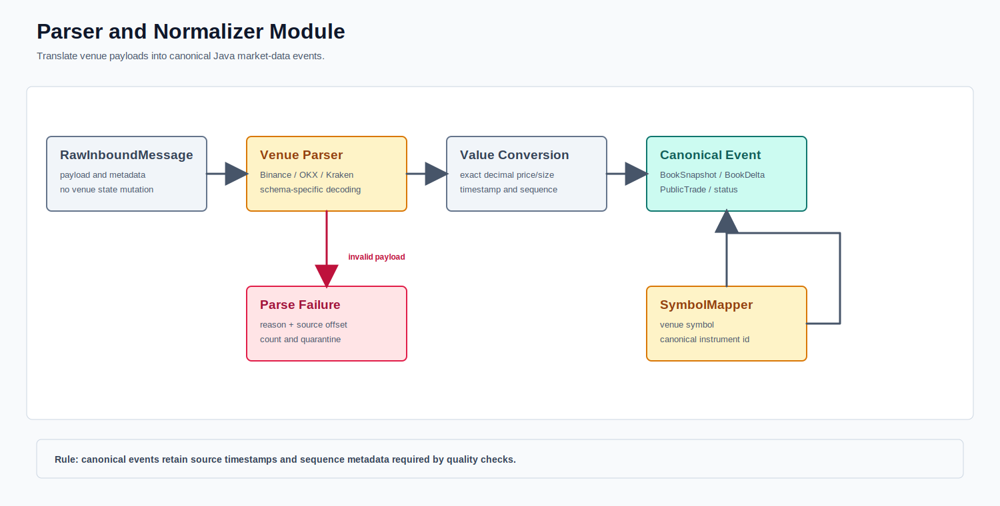

# Parser And Normalizer

Depth builders preserve the validated venue-specific snapshot/delta rules and emit an immutable canonical `BookSnapshot` after successful mutation. The canonical header includes venue, instrument, source/local sequence, stream epoch, exchange/receive/publish clocks, and schema version.

`BinancePublicTradeNormalizer`, `OkxPublicTradeNormalizer`, and `KrakenPublicTradeNormalizer` convert public JSON trades into `PublicTrade`. Missing identifiers, invalid decimals, and nonpositive values fail explicitly. Aggressor side is mapped only from venue-provided fields; it is never inferred from book movement.