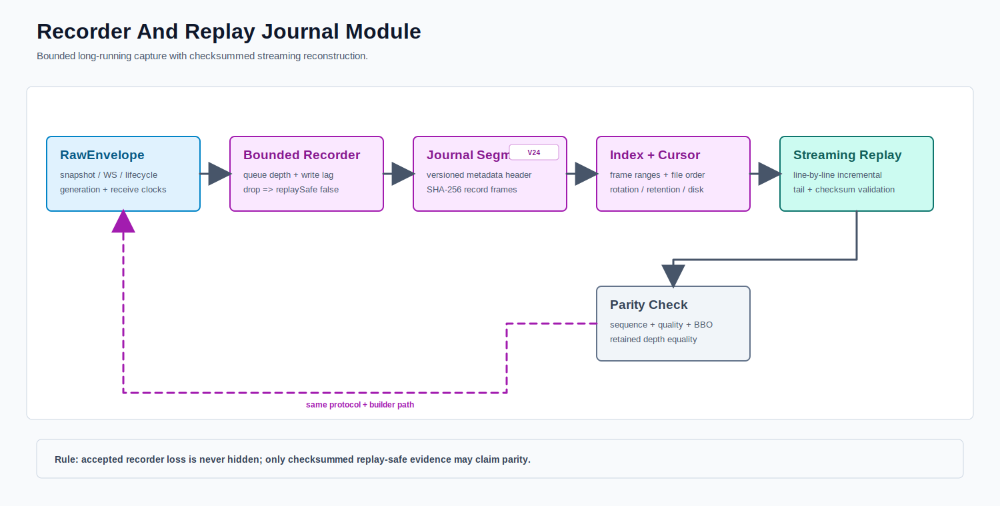

# Recorder And Replay Module



PNG fallback: [recorder-replay.png](recorder-replay.png)

Replay makes correctness and latency comparisons reproducible.

## Recording Levels

```text
raw        -> exact venue payload and receive metadata
normalized -> parser output and canonical identifiers
accepted   -> quality-approved event or book state
```

Raw recording is the strongest debugging evidence. Normalized and accepted recording make downstream parity checks faster.

## Replay Contract

The replay source implements the same producer contract as live intake and supports original timing, accelerated timing, or maximum speed. Downstream parser, quality, book, engine, and strategy code should not need a replay-specific branch.

## Current Code

```text
src/main/java/com/example/hft/datasource/replay/
```
