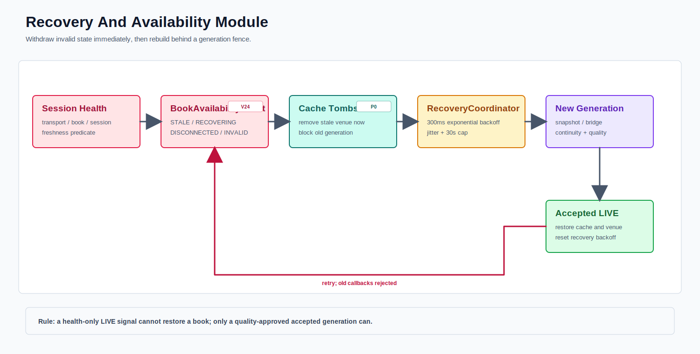

# Session Health, Availability, And Recovery Module



PNG fallback: [recovery.png](recovery.png)

Recovery is a generation-fenced state rebuild, not merely a socket reconnect.

```text
TransportState: DISCONNECTED, CONNECTING, CONNECTED
BookState: EMPTY, BOOTSTRAPPING, LIVE, STALE, GAP_DETECTED,
           CHECKSUM_FAILED, CROSSED, DEGRADED
SessionState: STARTING, LIVE, DEGRADED, RECOVERING, STOPPED
```

Publication requires `CONNECTED + LIVE book + LIVE session + fresh message`. Any departure emits `BookAvailabilityEvent`, tombstones cache state, and removes the venue from downstream views.

`StaleWatchdog` marks silence STALE/DEGRADED and requests recovery. `RecoveryCoordinator` uses thread-safe scheduling, jittered exponential backoff from 300 ms to 30 seconds, and clears the scheduling gate before a reconnect attempt so a fast failure can retry. `generation` rejects callbacks from superseded sockets. `stop()` cancels pending reconnects.

A newer generation remains unavailable until snapshot/bridge, continuity, and quality checks produce an accepted LIVE book. Successful return to accepted LIVE resets backoff. Metrics include message/accepted times, age, stale transitions, reason, reconnect attempts/successes/failures, and recovery duration.