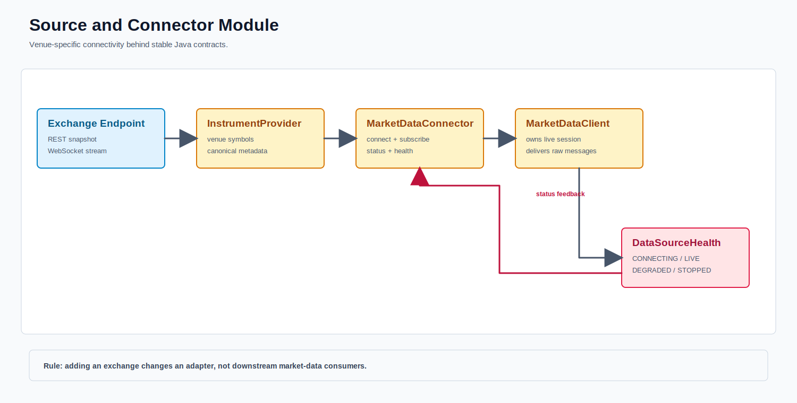

# Source And Connector

The current source set contains six depth streams and six public-trade streams for BTC-USDT and ETH-USDT on Binance.US, OKX, and Kraken. Depth sources retain venue snapshot/recovery semantics; trade sources have independent stream epochs and subscriptions.

Reference metadata maps `BTCUSDT`, `BTC-USDT`, and `BTC/USDT` to canonical `InstrumentId("BTC-USDT")`. Transport identities remain venue specific, while downstream state uses canonical identity.