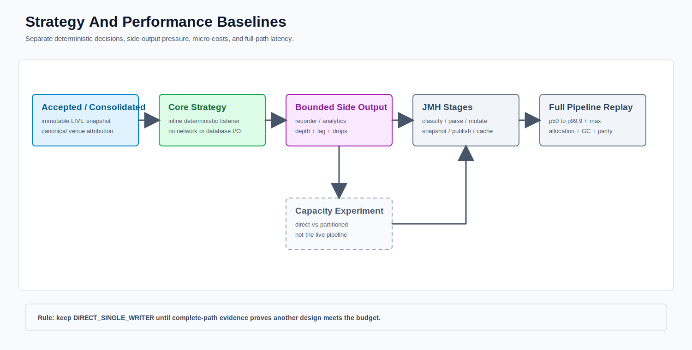

# Strategy And Performance Baseline Module



PNG fallback: [strategy-benchmark.png](strategy-benchmark.png)

Strategies consume only immutable LIVE accepted or consolidated snapshots. Availability events remove inactive generations immediately.

## JMH Microbenchmarks

`DeepBookJmhBenchmark` measures venue classification, Jackson JSON parsing, book mutation, snapshot creation, `LocalBookPublisher`, and cache/event publication. Defaults include three warmups, five measurements, one fork, sample-time and throughput modes, and GC allocation profiling.

## Full Replay Benchmark

`FullPipelineReplayBenchmark` uses the production-shaped path:

```text
ingress -> recorder offer -> protocol -> parse -> book mutation -> quality
-> snapshot -> engine -> cache -> core listeners -> async side output
```

It separately reports bootstrap and incremental latency, per-stage p50/p95/p99/p99.9/max, corrected end-to-end latency, throughput, allocation bytes/message, GC count/pause, recorder and listener lag/drop state, rejected messages, and final replay parity. JSON and Markdown artifacts are generated.

The existing direct-versus-partitioned replay remains a capacity experiment. It must not be interpreted as the complete live pipeline.