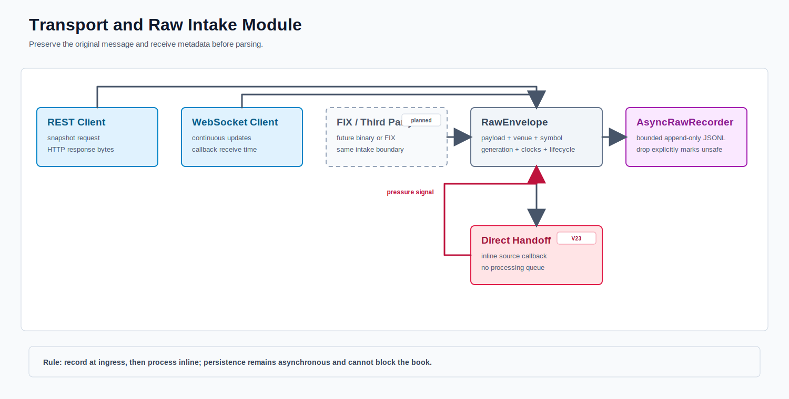

# Transport And Intake

`VenueTransport` and `SnapshotProvider` isolate JDK WebSocket and HTTP behavior behind injectable interfaces. Every callback carries a generation; callbacks from an older connection are ignored.

`VenueProtocolStateMachine` handles subscription acknowledgements, venue errors, heartbeat, and pong timeout separately from book mutation. Complete and fragmented WebSocket text frames are assembled before classification. Raw lifecycle and payload records are offered to the bounded journal before book processing.